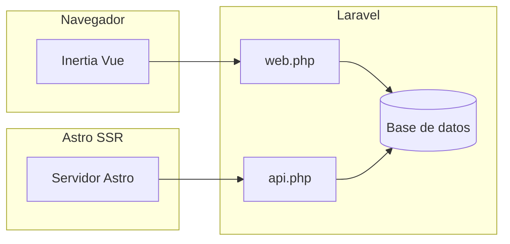

# Catálogo digital (brochure)

Aplicación para gestionar y mostrar una **carta digital**: secciones (incluida lógica por día de la semana y ventanas de publicación), categorías, platos u ofertas modelados como **servicios**, y **etiquetas**. Los textos por defecto del héroe del catálogo reflejan el caso de uso “La Piojera de la Ely” / carta semanal; se pueden sustituir por variables de entorno (ver más abajo).

En el **catálogo público** (Inertia y Astro) hay enlaces **“Pedir por WhatsApp”** por comida y, cuando un día tiene al menos dos platos cargados, un botón para **pedir el menú completo del día** (mensaje prellenado vía `https://wa.me/...`). El número se configura con `WHATSAPP_ORDER_PHONE` (solo dígitos, con código de país; ver sección de variables de entorno).

## Arquitectura

Hay **un backend Laravel** que persiste en base de datos y expone:

- Rutas **web** con **Inertia + Vue**: autenticación, panel de administración y una vista pública `/catalog` (catálogo con botones de WhatsApp si hay `WHATSAPP_ORDER_PHONE` en `.env`).
- Una **API JSON** `GET /api/catalog-layout` con el layout completo (secciones anidadas) para el frontend **Astro** en modo SSR (por defecto `http://localhost:4321`; enlaces de WhatsApp configurados en `astro-catalog/.env`).



## Stack tecnológico

| Capa | Tecnología |
|------|------------|
| Backend | Laravel 12, PHP ^8.2, Laravel Fortify |
| Panel y catálogo web | Vue 3, Inertia.js, Vite 7, Tailwind CSS 4, TypeScript (`vue-tsc`) |
| API | Rutas en `routes/api.php` (prefijo `/api` por defecto en Laravel) |
| Catálogo público alternativo | Astro 6, `@astrojs/node` (SSR), GSAP; Node >= 22.12.0 |

## Estructura del repositorio (resumen)

| Ruta | Contenido |
|------|-----------|
| `app/` | Modelos, controladores, requests, middleware |
| `routes/web.php` | Rutas Inertia y administración |
| `routes/api.php` | API del layout del catálogo |
| `resources/js/` | Páginas y componentes Vue (Inertia) |
| `database/migrations/` | Esquema: usuarios, tags, servicios, categorías, secciones, pivotes |
| `database/seeders/` | Usuario de prueba, carta semanal por día (`WeekdayMenu*`) |
| `config/catalog.php` | Textos del héroe mapeados desde `.env` |
| `config/business.php` | Teléfono de pedidos por WhatsApp (`WHATSAPP_ORDER_PHONE`) para el catálogo Inertia |
| `astro-catalog/` | Proyecto Astro que consume la API (ver [astro-catalog/README.md](astro-catalog/README.md)) |

## Requisitos previos

- PHP y extensiones habituales para Laravel
- Composer
- Node.js (para Vite/Vue; para Astro usar Node >= 22.12.0 en `astro-catalog/`)
- Base de datos: el `.env.example` del proyecto usa **SQLite** por defecto (`DB_CONNECTION=sqlite`)

## Puesta en marcha (Laravel + Inertia)

En la **raíz** del repositorio:

1. Copiar entorno: `cp .env.example .env` (o equivalente en Windows).
2. Generar clave: `php artisan key:generate`
3. Dependencias PHP: `composer install`
4. Base de datos: crear `database/database.sqlite` si usas SQLite y ejecutar `php artisan migrate`
5. Front principal: `npm install` y, en desarrollo, `npm run dev` (Vite)

Para arrancar backend, cola y Vite juntos:

```bash
composer run dev
```

Esto usa `concurrently` para `php artisan serve`, `php artisan queue:listen` y `npm run dev` (ver `composer.json`).

Build de assets para producción:

```bash
npm run build
```

### Carta semanal de ejemplo (seeders)

El proyecto incluye datos de demostración alineados con una carta **Lunes → Domingo**, con **Desayuno, Almuerzo y Cena** por día:

| Seeder | Rol |
|--------|-----|
| `WeekdayMenuSectionsSeeder` | Crea las 7 secciones (`weekday` 1–7) |
| `WeekdayMenuCoursesSeeder` | Por cada día, 3 categorías (desayuno / almuerzo / cena) enlazadas a la sección |
| `WeekdayMenuDishesSeeder` | Crea un plato (`Service`) por categoría; **re-ejecutable** (reemplaza servicios de esas categorías) |

`DatabaseSeeder` invoca `WeekdayMenuDishesSeeder` tras el usuario de prueba. Comandos útiles:

```bash
php artisan db:seed --class=WeekdayMenuDishesSeeder
php artisan migrate:fresh --seed
```

### Servidor local (`.test`, Laragon, etc.)

La aplicación debe apuntar al directorio **`public/`** como document root. La ruta `GET /` redirige a login o dashboard; si ves **404**, comprobá el virtual host y probá `php artisan serve` para aislar el problema. Ajustá `APP_URL` en `.env` a la URL real (por ejemplo `http://la-piojera-de-la-ely.test`).

## Variables de entorno (Laravel)

Principales entradas en `.env` (ver `.env.example`):

| Variable | Uso |
|----------|-----|
| `APP_URL` | URL pública de la aplicación |
| `DB_*` | Conexión a la base de datos (por defecto SQLite) |
| `CATALOG_HERO_PRE_HEADLINE`, `CATALOG_HERO_HEADLINE`, `CATALOG_HERO_SUB_HEADLINE`, `CATALOG_HERO_CTA_TEXT`, `CATALOG_HERO_CTA_URL` | Textos del bloque héroe expuestos en la API; definidos en `config/catalog.php` |
| `CORS_ALLOWED_ORIGINS` | Orígenes permitidos para rutas bajo `api/*` y `sanctum/csrf-cookie`; lista separada por comas. En el ejemplo puede ser `*` (ver `config/cors.php`) |
| `VITE_APP_NAME` | Nombre expuesto al front Vite |
| `WHATSAPP_ORDER_PHONE` | Número para pedidos por WhatsApp en `/catalog` (Inertia), solo dígitos con código de país, sin `+` (p. ej. `56912345678`). Se lee en `config/business.php` y se comparte a todas las respuestas Inertia vía `HandleInertiaRequests`. Si está vacío, no se muestran los botones |

Para que **Astro** en local llame al API sin bloqueo CORS, restringe orígenes al host de Astro, por ejemplo:

```env
CORS_ALLOWED_ORIGINS=http://localhost:4321
```

(Ajusta el puerto si Astro usa otro.)

## Rutas principales

| Ruta | Descripción |
|------|-------------|
| `GET /` | Redirige a login o al dashboard según la sesión |
| `GET /catalog` | Catálogo público en Inertia: **un bloque por día** (misma lógica de secciones que la API), con Desayuno / Almuerzo / Cena; en cada comida con plato cargado puede mostrarse **Pedir por WhatsApp**; si un día tiene **dos o más** comidas con plato, además **Pedir el menú del día**. Las imágenes son opcionales y se cargan desde administración |
| `GET /dashboard` y rutas de Fortify | Área autenticada (usuario verificado) |
| `GET /admin/...` | CRUD y acciones de administración: `services`, `tags`, `categories`, `sections` (reordenar, activar/desactivar servicios, etc.) |
| `GET /api/catalog-layout` | JSON del layout completo para Astro u otros clientes (`CatalogLayoutController`) |

Detalle de prefijos y middleware en `routes/web.php` y `routes/api.php`.

## Modelo de dominio

- **CatalogSection**: nombre, slug, descripción, `is_active`, `sort_order`, `weekday` (1–7, opcional), ventana opcional `starts_at` / `ends_at`. Relación **muchos a muchos** con `Category` (tabla pivote `catalog_section_category`, con `sort_order` en el pivote).
- **Category**: agrupa **Service**; puede incluir campos de menú (`menu_heading`, `menu_course`, etc., según migraciones).
- **Service**: plato u oferta; precio, textos, imagen; relación con **Tag** (muchos a muchos); puede asociarse a secciones vía pivote `catalog_section_service` donde aplique el modelo de datos actual.
- **Tag**: etiquetas para filtrar o clasificar servicios.

La API del layout aplica:

- Secciones **activas** y **visibles en el instante actual** (`starts_at` / `ends_at` nulos o dentro del rango), ver scopes en `App\Models\CatalogSection`.
- Categorías y servicios **activos**, con orden definido en el controlador.

La página Inertia `/catalog` usa el **mismo criterio de secciones, categorías y servicios** que `CatalogLayoutController` (secciones activas y visibles ahora, categorías y platos activos ordenados). Los datos se envían a Vue como `weekdays` (día → comidas → plato).

## API `GET /api/catalog-layout`

Respuesta JSON de alto nivel:

- `meta`: `generated_at` (ISO 8601), `timezone` (de `config('app.timezone')`).
- `hero`: `pre_headline`, `headline`, `sub_headline`, `cta_text`, `cta_url` (desde `config('catalog.hero')` / env, con fallbacks en código si una cadena viene vacía).
- `sections`: array ordenado de secciones, cada una con `id`, `name`, `slug`, `description`, `is_active`, `weekday`, `starts_at`, `ends_at`, y `categories`.
- Cada **categoría** incluye `id`, `name` (prioriza `menu_heading` si existe), `slug`, `menu_course`, y `services`.
- Cada **servicio** incluye `id`, `title`, `subtitle`, `short_description`, `long_description`, `price`, `price_formatted`, `image_url`, `tags` (`id`, `name`, `slug`).

Implementación: `App\Http\Controllers\Api\CatalogLayoutController`.

## Frontend Astro (subproyecto)

El catálogo puede mostrarse también con **SSR** desde la carpeta `astro-catalog/`, en local típicamente en **`http://localhost:4321`**. No es el mismo build que Inertia: consume la API en tiempo de ejecución (`CATALOG_API_URL`) e incluye los mismos flujos de **WhatsApp** por plato y por menú del día, configurados con **`WHATSAPP_ORDER_PHONE`** en `astro-catalog/.env` (ver README del subproyecto).

**Dirección visual**: estética de **picada chilena** (papel kraft con grano, tinta roja, pizarra, mantel a cuadros, washi tape, sellos), tipografías DM Serif Display + Mansalva + Special Elite + Lora. El hero calcula el día actual server-side (sello "DEL DÍA" + pizarra). Todo el sistema de diseño vive en CSS — paleta, componentes y detalles de implementación documentados en el README del subproyecto.

Instrucciones detalladas de instalación, `.env`, comandos y diseño: **[astro-catalog/README.md](astro-catalog/README.md)**.

## Mostrar solo la carta de hoy (próximo paso)

Hoy la API y los dos catálogos (Inertia y Astro) devuelven la **carta semanal completa** (Lun → Dom) en una sola respuesta: `CatalogLayoutController` filtra por `active()` y `visibleNow()` (ventanas `starts_at` / `ends_at`), pero **no filtra por `weekday`**, sólo lo usa para ordenar (`app/Http/Controllers/Api/CatalogLayoutController.php`). El campo `weekday` viaja en el JSON y se usa para etiquetar cada bloque ("Lunes", "Martes", …).

El **hero de Astro** ya muestra el día actual (sello "DEL DÍA" + pizarra con el nombre del día) calculado server-side en `astro-catalog/src/components/Hero.astro`. Falta extender ese criterio al listado.

Tres caminos posibles, ordenados de menos a más invasivo:

### 1. Filtrar en el frontend Astro (rápido, no toca Laravel)

En `astro-catalog/src/pages/index.astro`, antes del `data.sections.map(...)`:

```ts
const dow = new Date().getDay();           // 0 = Domingo, 1 = Lunes, …, 6 = Sábado
const todayWeekday = dow === 0 ? 7 : dow;  // mapear a 1–7 (Lun=1, Dom=7)
const sectionsToday = data.sections.filter(
	(s) => s.weekday == null || s.weekday === todayWeekday
);
```

Pasar `sectionsToday` al `<SectionBlock>`. Las secciones sin `weekday` (ofertas siempre disponibles) se siguen mostrando.

### 2. Híbrido recomendado: hoy destacado + resto en acordeón

- Sección de hoy arriba con foco visual completo.
- Las otras 6 quedan colapsadas detrás de un toggle "Ver carta de los otros días".
- Mantiene descubrimiento sin abrumar y respeta la curiosidad por el resto de la semana.

### 3. En Laravel (más limpio si querés que `/catalog` también lo respete)

Agregar un scope al modelo `App\Models\CatalogSection`:

```php
public function scopeForWeekday(Builder $query, int $weekday): Builder
{
	return $query->where(function (Builder $q) use ($weekday) {
		$q->whereNull('weekday')->orWhere('weekday', $weekday);
	});
}
```

En `CatalogLayoutController` (y en el controlador Inertia equivalente), aplicar el scope cuando exista una flag o query param:

```php
$weekday = (int) (request('weekday') ?? now()->isoWeekday()); // 1=Lun … 7=Dom
$query = CatalogSection::query()->active()->visibleNow();
if (config('catalog.filter_by_today', false)) {
	$query->forWeekday($weekday);
}
```

Y exponerlo como `CATALOG_FILTER_BY_TODAY=true` en `.env` (definirlo en `config/catalog.php`).

> **Tip**: si elegís 3, recordá que `WeekdayMenuDishesSeeder` crea 7 secciones, y ahora con el filtro la API devolvería solo 1 (más las generales). El hero de Astro seguirá funcionando porque calcula el día por su cuenta; la pizarra y el listado quedarán en sintonía.

## Calidad, formato y pruebas

Comandos útiles definidos en `composer.json` y `package.json`:

- `composer run lint` / `composer run lint:check` (Pint)
- `composer run test` (Pest/PHPUnit tras lint)
- `composer run ci:check` (lint, format check, types, tests)
- `npm run lint` / `npm run format:check` / `npm run types:check`

---

Licencia del proyecto: ver `composer.json` (MIT en el esqueleto Laravel).
